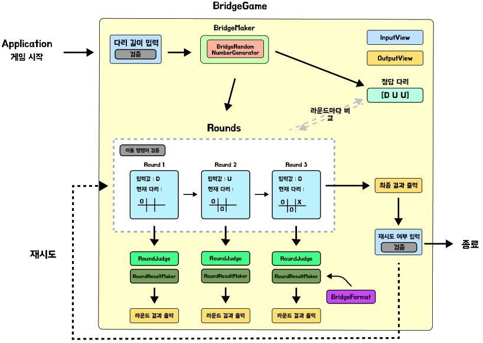

## 🎯 구현할 기능 목록

    
게임 진행순서

1. 다리의 길이 입력
    - `InputView`: 다리의 길이를 입력받음
    - `BridgeMaker`: 입력받은 값의 길이를 갖는 다리 배열 생성
    - `OutView` : 안내 메세지 출력   

2. 다리를 건널때 까지 이동할 칸 입력 (위: U, 아래: D)
    - `InputView`: 이동할 칸의 명령어를 입력받음
    - `BridgeGame`: 입력한 다리길이만큼 갈때까지 진행
    - `OutView`
        - 다리를 이동할때 마다 현재 다리의 진행상태를 출력 
        - 안내 메세지 출력
  
 
3. 최종 게임 결과 출력
    - `OutView` : 다리 출력

4. 재시도 여부 결정 (재시도: R, 종료: Q)
    - `InputView`: 리플레이 여부를 입력받음
    - `OutView` : 안내 메세지 출력
    
         

    4-1.  종료
        - `OutView` : 실패메세지와 총 시도횟수 출력

         

    4.2. 재시도 : 2번부터 다시 시작

     
    

    

 

- `service` 패키지
    - `BridgeGame` : 다리건너기 게임을 관리하는 컨트롤러 클래스
    - `BridgeMaker` : 사용자가 입력한 길이를 가진 다리를 생상하는 클래스
    - `GameAttribute` : 게임에 관련된 요소들을 상수로 갖는 `enum`
    - `Round` : 게임내에서 존재하는 각 라운드를 생성하는 클래스
    - `RoundJudge` : 각 라운드의 실패와 성공등의 판정을 내리는 클래스
    - `RoundResultMaker` : 각 라운드마다 출력되는 다리를 만드는 클래스
    

- `util` 패키지
    - `InputView` : 게임중 사용자의 입력을 받는 클래스
    - `OutputView` : 게임중 출력을 담당하는 클래스

- `validation` 패키지
    - `Validation` : 사용자의 입력값을 검증하는 클래스
   

- `view` 패키지
    - `Errors` : 사용자의 입력값 오류시 발생하는 에러 메세지들을 상수로 갖는 `enum`
    - `Messages` : 게임 진행중 출력되는 메세지들을 상수로 갖는 `enum`

- `constant` 패키지
    - `Bridge` : 다리의 기본 설정 요소들을 상수로 갖는 `enum`  
    - `BridgPiece` : 다리가 출력될 때 필요한 요소들을 상수로 갖는 `enum`  
    - `GameCommand` : 게임 실행중 입력되는 명령어들 상수로 갖는 `enum`  
    - `GameResultConstant` : 게임에 대한 결과를 상수로 갖는 `enum`  

